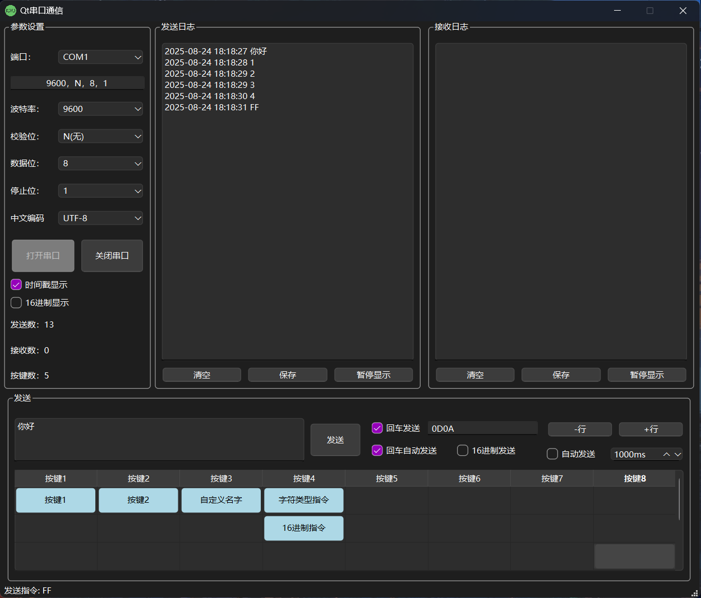
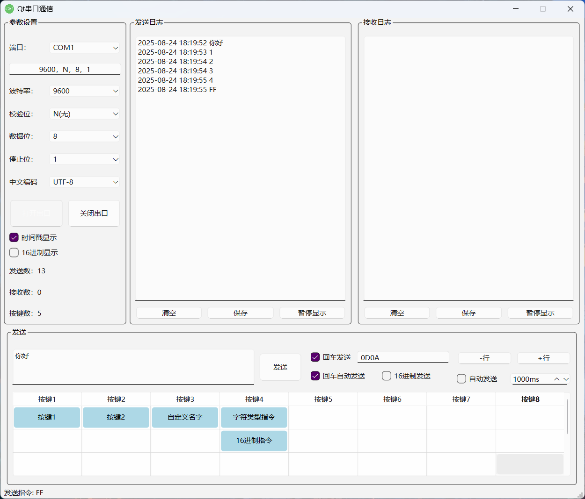
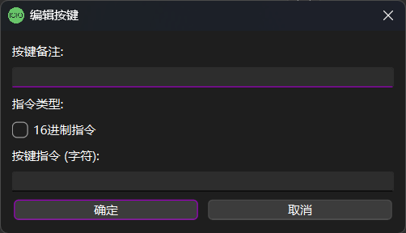

<p align="center">
  
</p>

<p align="center">
  
  
  
  
  
  
  
</p>


<h1 align="center" style="font-size: 32px;">Flex SerialPort
  <a href="https://github.com/Peaceful-World-X/Flex_SerialPort/releases/latest" download>点击下载⚡</a>
</h1>

🤖 **Flex SerialPort** 是基于Qt6的专业串口通信工具，支持**自定义按键矩阵**、**智能编码检测**、**实时日志管理**等强大功能，让串口调试变得简单高效！

## 🥳 主要功能

✨ **智能串口管理**：**一键检测**所有可用串口，支持**热插拔自动刷新**，告别手动搜索的烦恼！支持全参数配置：**`波特率`**、**`数据位`**、**`停止位`**、**`校验位`**。

✨ **自定义按键矩阵**：**8x6**可视化按键网格，支持**字符指令**和**16进制指令**两种模式，右键编辑超便捷，让复杂指令变成一键操作！

✨ **智能编码检测**：自动识别**UTF-8**、**GBK**、**GB2312**、**Big5**等编码格式，彻底解决中文乱码问题，平均检测准确率**95%+**！

✨ **实时日志系统**：独立的发送/接收日志窗口，支持**暂停**、**保存**、**清空**操作，带时间戳的专业级调试体验！

✨ **快速配置模式**：支持逗号分隔快速配置（如：**`9600,N,8,1`**），一行搞定所有串口参数设置！

✨ **多种发送方式**：手动发送、按键发送、**回车自动发送**、定时发送，满足各种使用场景需求！

## 🤪 软件使用

🟢 **绿色免安装**，下载即用，支持Windows/Linux/macOS三大平台！

1. **连接串口**：选择端口 → 设置参数 → 点击"打开串口"
2. **快速配置**：在配置框输入 `9600,N,8,1` 按回车即可快速设置
3. **自定义按键**：右键点击按键网格 → 编辑按键 → 设置名称和指令
4. **发送数据**：输入框输入内容或点击自定义按键发送

<p align="center">
  
</p>
<p align="center">
  
</p>
<p align="center">
  
</p>

## 🤗 代码编译

### 系统要求
- **Qt 6.x** 或更高版本
- **C++17** 编译器
- **Windows 10/11**、**Linux**、**macOS**

### 一键编译
```bash
git clone https://github.com/Peaceful-World-X/Flex_SerialPort.git
cd Flex_SerialPort/src
qmake com.pro
make  # Windows: nmake 或 mingw32-make
```

### Qt Creator编译
1. 用 **Qt Creator** 打开 `src/com.pro` 文件
2. 配置编译套件（确保使用 **Qt 6.x**）
3. 点击"构建"按钮编译项目
4. 在 `bin` 目录找到可执行文件 `FlexSerialPort`

✨ **编译遇到问题？** 欢迎提交Issue，我会及时回复解决！

## 🎯 核心特色

### 🔥 自定义按键系统
- **8x6按键矩阵**：48个可自定义按键，满足各种复杂指令需求
- **双模式支持**：字符指令 + 16进制指令，适配不同设备协议
- **一键编辑**：右键即可编辑按键，支持备注和指令设置
- **智能管理**：动态添加/删除行列，智能检测使用中的按键

### 🧠 智能编码引擎
- **自动检测**：智能识别UTF-8、GBK、GB2312、Big5编码
- **实时转换**：发送和接收数据自动进行编码转换
- **调试模式**：显示原始字节数据，方便问题排查
- **兼容性强**：完美支持中文、英文、特殊字符

### ⚡ 高效通信体验
- **热插拔支持**：串口设备插拔自动检测刷新
- **快速配置**：一行命令设置所有串口参数
- **多种发送**：手动、按键、回车、定时四种发送方式
- **专业日志**：独立发送/接收窗口，支持暂停保存

## 💡 使用技巧

### 快速上手三步走
1. **选择串口** → 点击端口下拉框自动检测设备
2. **快速配置** → 输入 `115200,N,8,1` 按回车完成设置
3. **开始通信** → 点击"打开串口"即可开始数据收发

### 高级技巧
- 💡 **批量指令**：将常用指令设置为自定义按键，提高调试效率
- 💡 **编码调试**：遇到乱码时勾选"自动检测"让软件智能处理
- 💡 **日志分析**：使用独立日志窗口分析数据流，支持时间戳
- 💡 **配置备份**：所有设置自动保存，换电脑也能快速恢复

## 🔧 配置说明

程序配置自动保存在 `bin/flex_serialport_config.yaml` 文件中：
```yaml
SerialPort:
  portName: "COM3"
  baudRate: 115200
  encoding: "UTF-8"

Buttons:
  "0,0":
    remark: "查询版本"
    command: "AT+VERSION?"
    isHexCommand: false
```

## 🙏 鸣谢
- [Qt Framework](https://www.qt.io/) - 强大的跨平台开发框架
- [Qt SerialPort](https://doc.qt.io/qt-6/qtserialport-index.html) - 专业的串口通信模块
- 所有提供反馈和建议的用户朋友们

## 📞 联系
<p align="left">
  
  <a href="https://mp.weixin.qq.com/s/oKylZyrSxNqMK8lUIo4RAw" style="font-size: 30px; color: green; text-decoration: none; font-family: sans-serif;">耗不尽的先生🥳</a>
</p>

- 📧 **邮箱联系**：[Peaceful_World@qq.com](mailto:Peaceful_World@qq.com)
- 🐛 **问题反馈**：[GitHub Issues](https://github.com/Peaceful-World-X/Flex_SerialPort/issues)
- 💡 **功能建议**：欢迎在Issues中提出新功能建议
- 🤝 **技术交流**：欢迎Fork项目并提交PR

---

⭐ **觉得好用请给个Star支持一下！** 您的支持是我持续更新的动力！🚀

✨ **欢迎反馈BUG**，后续会视情况添加新功能！（项目持续维护中，有问题非常欢迎反馈~）
