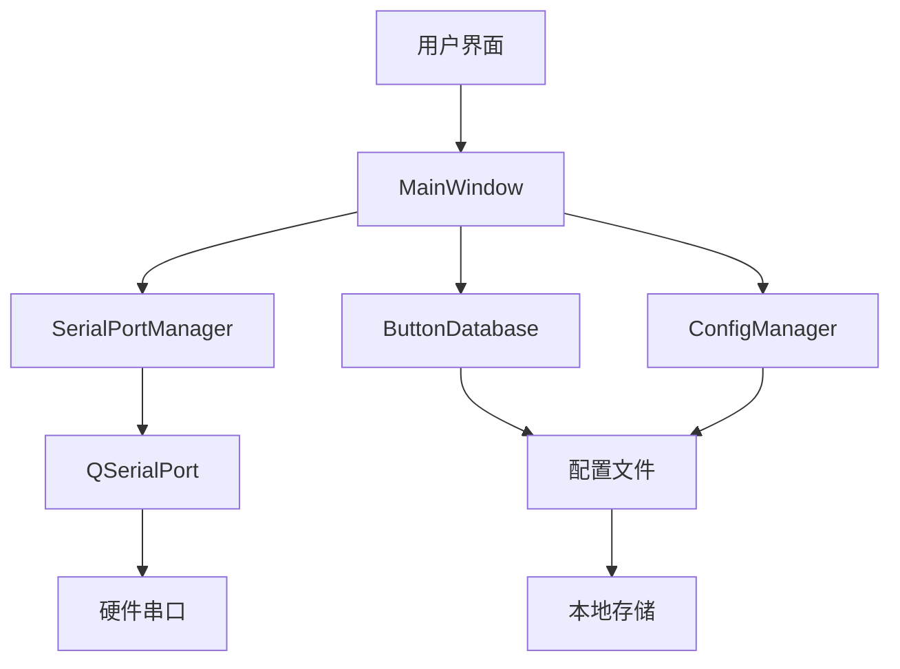

# 项目结构说明

本文档详细说明了 Flex SerialPort 项目的目录结构和文件组织。

## 📁 目录结构

```
Flex_SerialPort/
├── 📄 README.md                    # 项目说明文档
├── 📄 LICENSE                      # MIT 许可证
├── 📄 .gitignore                   # Git 忽略文件配置
├── 📁 src/                         # 源代码目录
│   ├── 📄 main.cpp                 # 程序入口点
│   ├── 📄 com.pro                  # Qt 项目文件
│   ├── 📄 com.ico                  # 应用程序图标
│   ├── 🎨 mainwindow.ui            # 主窗口UI设计文件
│   ├── 🔧 mainwindow.h             # 主窗口头文件
│   ├── 🔧 mainwindow.cpp           # 主窗口实现文件
│   ├── 🔧 serialportmanager.h     # 串口管理器头文件
│   ├── 🔧 serialportmanager.cpp   # 串口管理器实现
│   ├── 🔧 buttondatabase.h        # 按键数据库头文件
│   ├── 🔧 buttondatabase.cpp      # 按键数据库实现
│   ├── 🔧 configmanager.h         # 配置管理器头文件
│   ├── 🔧 configmanager.cpp       # 配置管理器实现
│   ├── 🔧 logmanager.h            # 日志管理器头文件
│   └── 🔧 logmanager.cpp          # 日志管理器实现
├── 📁 docs/                       # 文档目录
    ├── 📄 PROJECT_STRUCTURE.md    # 项目结构说明
    ├── 🖼️ 深色主题.png             # 深色主题截图
    ├── 🖼️ 浅色主题.png             # 浅色主题截图
    └── 🖼️ 按键自定义.png           # 按键自定义截图

```

## 🔧 核心源文件说明

### main.cpp
```cpp
// 程序入口点
// 负责：
// - 创建 QApplication 实例
// - 初始化主窗口
// - 启动事件循环
```

### MainWindow 类
**文件**: `mainwindow.h`, `mainwindow.cpp`, `mainwindow.ui`

**职责**:
- 主用户界面管理
- 串口通信控制
- 用户交互处理
- 界面状态管理

**主要功能**:
```cpp
class MainWindow : public QMainWindow {
    // 串口管理
    void findFreePorts();
    bool initSerialPort();
    void sendMsg(const QString &msg);
    void recvMsg();

    // 自定义按键
    void setupTableWidget();
    void onTableCellClicked(int row, int column);
    void onEditButtonData();

    // 配置管理
    void saveAllConfigs();
    void loadAllConfigs();

    // 编码处理
    QByteArray encodeText(const QString &text, const QString &encoding);
    QString decodeText(const QByteArray &data, const QString &encoding);
};
```

### SerialPortManager 类
**文件**: `serialportmanager.h`, `serialportmanager.cpp`

**职责**:
- 串口设备管理
- 数据收发处理
- 连接状态监控
- 错误处理

**主要功能**:
```cpp
class SerialPortManager : public QObject {
    // 端口管理
    QStringList getAvailablePorts();
    bool openPort(const QString &portName, int baudRate, ...);
    void closePort();

    // 数据传输
    qint64 sendData(const QByteArray &data);
    qint64 sendHexData(const QString &hexString);
    qint64 sendTextData(const QString &text);

    // 统计信息
    qint64 getSentBytes() const;
    qint64 getReceivedBytes() const;
};
```

### ButtonDatabase 类
**文件**: `buttondatabase.h`, `buttondatabase.cpp`

**职责**:
- 自定义按键数据管理
- 配置文件读写
- 按键布局管理

**数据结构**:
```cpp
struct ButtonData {
    QString remark;      // 按键备注
    QString command;     // 按键指令
    int row, col;        // 位置信息
    bool isValid;        // 是否有效
    bool isHexCommand;   // 指令类型
};

struct SerialPortConfig {
    QString portName;
    int baudRate;
    // ... 其他串口参数
    QString encoding;    // 编码方式
};
```

### ConfigManager 类
**文件**: `configmanager.h`, `configmanager.cpp`

**职责**:
- 应用程序配置管理
- 窗口状态保存
- 用户偏好设置

### LogManager 类
**文件**: `logmanager.h`, `logmanager.cpp`

**职责**:
- 日志记录管理
- 日志文件操作
- 日志格式化

## 🎨 UI 设计文件

### mainwindow.ui
Qt Designer 设计的主窗口界面，包含：

**主要控件**:
- `portName`: 端口选择下拉框
- `baudRate`: 波特率选择
- `dataBits`: 数据位选择
- `stopBits`: 停止位选择
- `parity`: 校验位选择
- `tableWidget`: 自定义按键表格
- `message`: 发送消息输入框
- `comLog_1`: 发送日志显示
- `comLog_2`: 接收日志显示
- `comboBox_encoding`: 编码选择
- `checkBox_autoDetect`: 自动检测编码

**布局结构**:
```
MainWindow
├── 串口配置区域
│   ├── 端口选择
│   ├── 参数设置
│   └── 连接控制
├── 自定义按键区域
│   ├── 按键表格
│   └── 表格控制按钮
├── 数据发送区域
│   ├── 输入框
│   ├── 发送选项
│   └── 编码设置
└── 日志显示区域
    ├── 发送日志
    └── 接收日志
```

## 📦 编译输出

### bin/ 目录
编译后的可执行文件和运行时文件：

- **FlexSerialPort.exe** (Windows) / **FlexSerialPort** (Linux/macOS)
  - 主程序可执行文件
  - 包含所有功能的完整应用程序

- **flex_serialport_config.yaml**
  - 配置文件，存储用户设置
  - 自动生成，包含串口参数和按键配置

## 📚 文档结构

### docs/ 目录
项目文档集合：

- **PROJECT_STRUCTURE.md**: 项目结构说明（本文档）
- **API_REFERENCE.md**: API 参考文档
- **USER_MANUAL.md**: 详细用户手册

## 🖼️ 资源文件

### screenshots/ 目录
应用程序截图，用于文档和展示：
- 主界面截图
- 功能演示截图
- 设置界面截图

### resources/ 目录
应用程序资源文件：
- 图标文件
- 图片资源
- 配置模板

## 🔄 数据流



## 🏗️ 架构模式

项目采用 **MVC (Model-View-Controller)** 架构模式：

- **Model**: `ButtonDatabase`, `ConfigManager`, `SerialPortManager`
- **View**: `mainwindow.ui`, Qt 控件
- **Controller**: `MainWindow` 类

## 📋 编译依赖

### 必需依赖
- Qt 6.x Core, GUI, Widgets, SerialPort 模块
- C++17 兼容编译器

### 可选依赖
- yaml-cpp (可用 QSettings 替代)

## 🔧 构建系统

使用 **qmake** 构建系统：
- `com.pro`: 主项目文件
- 定义源文件、头文件、UI文件
- 配置编译选项和依赖

## 📝 配置文件格式

```yaml
# flex_serialport_config.yaml
SerialPort:
  portName: "COM1"
  baudRate: 9600
  encoding: "UTF-8"

Table:
  rows: 6
  cols: 8

Buttons:
  "0,0":
    remark: "按键1"
    command: "Hello"
    isHexCommand: false
```

---

这个项目结构设计遵循了软件工程的最佳实践，具有良好的模块化、可维护性和可扩展性。
